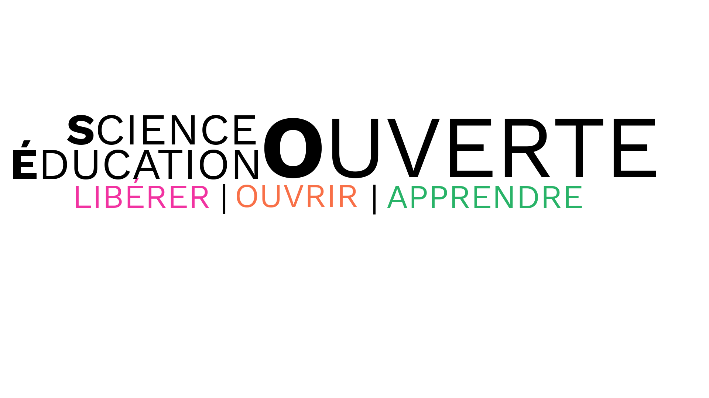

The Steering Committee is excited to announce a new identity for the organization known as the Open Science MOOC: Open Science OpenEd (a play on words in English). We will use the abbreviation OSOE.

This new identity is aligned with our vision of expanding beyond the MOOC model to include all types of open education about open science. 

Along with this new identity, we have created a new logo for the organisation. To fully embody the values of openness, this logo was created in GIMP open source image software using the open source font Work Sans. A special thanks to all who gave feedback on earlier versions of the new logo. The logo is available in [English](../assets/img/osm/osoe-logo-work-sans-spanish.png), [Spanish](../assets/img/osm/osoe-logo-work-sans-spanish.png), and [French](../assets/img/osm/osoe-logo-work-sans-french.png). Your suggestions for additional translations are very welcome.

We will be adopting the new name and visual identity throughout our materials over the course of the next few months. Please get in touch if you have any questions, suggestions, and/or offers of assistance for this work.

